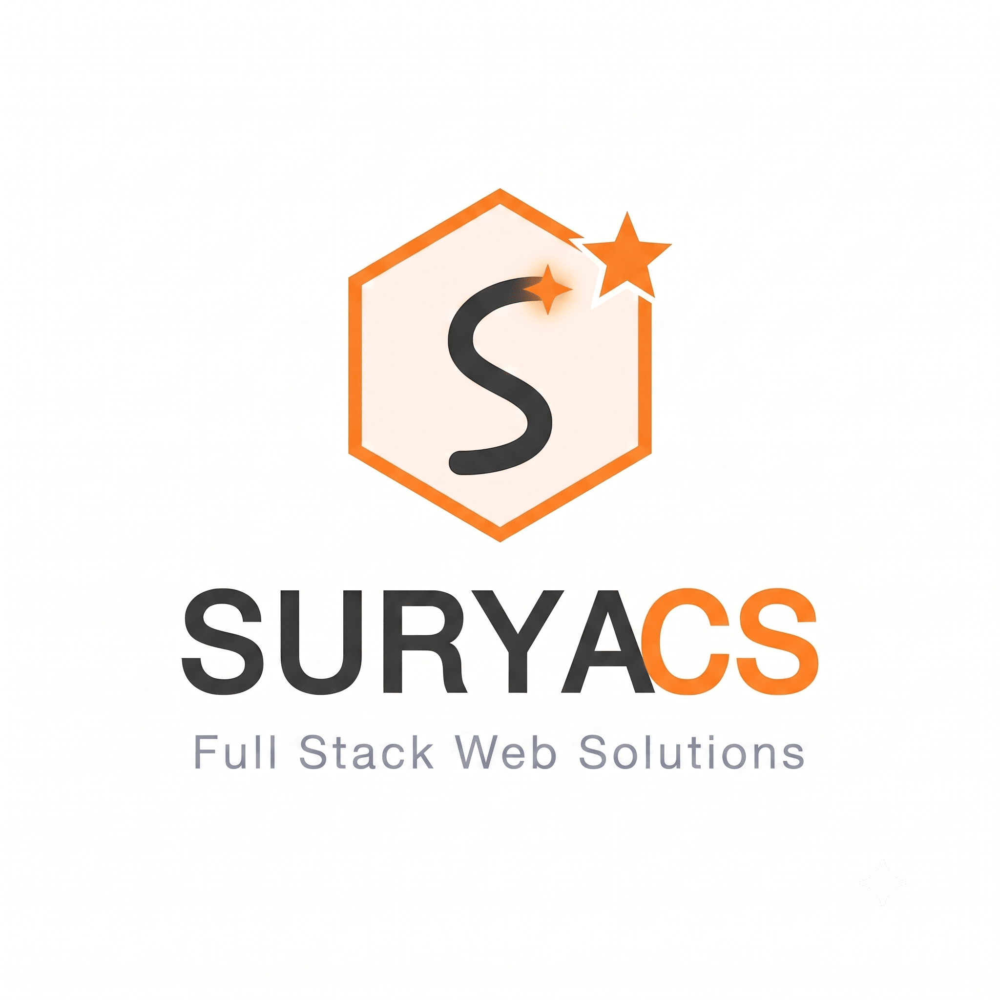

<!-- ========================================================= -->
<!--                     SURYACS PROFILE                       -->
<!-- ========================================================= -->

<p align="center">
  
</p>

<p align="center">
  
</p>

<p align="center">
  
</p>

<p align="center">
  <a href="https://github.com/Surya200622">
    
  </a>

  <a href="https://github.com/Surya200622?tab=repositories">
    
  </a>
</p>

---

# 👋 Hi, I'm Surya CS

### 💻 Full-Stack Developer | 🎨 Creative Designer | 🚀 Web Solutions Builder

I'm **Surya CS**, a Full-Stack Developer and Creative Designer passionate about building modern, responsive, user-friendly and business-focused web applications.

I enjoy combining **frontend development, backend engineering, databases and UI design** to turn ideas into practical digital products.

---

## 🙋‍♂️ About Me

- 💻 Full-Stack Web Developer
- 🎨 Creative Web Designer
- 🐍 Python & Django Developer
- ⚛️ React.js & Next.js Developer
- 🟢 Node.js & Express.js Developer
- 🗄️ Database & Backend Developer
- 🔌 REST API Developer
- 📱 Responsive Web Application Developer
- 🚀 Production Deployment & Hosting
- 💼 Open to freelance projects, collaborations and career opportunities
- 🎯 Interested in building real-world digital solutions

---

## 🚀 What I Do

<p align="center">
  
  
  
</p>

<p align="center">
  
  
  
</p>

<p align="center">
  
  
  
</p>

---

# 🧑‍💻 Skills & Technologies

## 💻 Languages

<p align="center">
  
</p>

<p align="center">
  
</p>

<p align="center">
  <b>HTML • CSS • JavaScript • SQL</b>
</p>

---

## ⚛️ Frameworks & Libraries

<p align="center">
  
</p>

<p align="center">
  <b>
    React.js • Next.js • Node.js • Express.js • Django •
    Bootstrap • Tailwind CSS
  </b>
</p>

---

## 🗄️ Databases

<p align="center">
  
</p>

<p align="center">
  
</p>

<p align="center">
  <b>MySQL • SQLite • Supabase • Turso</b>
</p>

---

## 🛠️ Tools & Platforms

<p align="center">
  
</p>

<p align="center">
  
</p>

<p align="center">
  <b>GitHub • Vercel • Google Business Profile • Cloudinary</b>
</p>

---

## 🧠 Core Concepts

<p align="center">
  

  
</p>

<p align="center">
  

  
</p>

---

## 🤝 Soft Skills

<p align="center">
  

  

  
</p>

<p align="center">
  

  
</p>

---

# 📊 GitHub Analytics

<p align="center">
  

  
</p>

---

# 🔥 GitHub Streak

<p align="center">
  
</p>

---

# 📈 Contribution Activity

<p align="center">
  
</p>

---

# 🚀 Featured Projects

<table>
  <tr>
    <td width="50%" valign="top">

### 🏥 DentalExperts

Professional dental platform and clinic management project.

**Tech Stack**

`Python` `Django` `HTML` `CSS` `JavaScript`

🔗 **[View Project](https://suryacs.pythonanywhere.com/)**

    </td>

    <td width="50%" valign="top">

### 🛍️ Cipher Apparel

Modern e-commerce storefront focused on responsive design and product presentation.

**Tech Stack**

`Django` `JavaScript` `CSS` `Responsive Design`

🔗 **[View Project](https://cipher-apparel.vercel.app/)**

    </td>
  </tr>

  <tr>
    <td width="50%" valign="top">

### 🤖 JARVIS AI

Web-based personal assistant interface designed for AI-powered interaction.

**Tech Stack**

`HTML` `CSS` `JavaScript` `AI`

🔗 **[View Project](https://jarvis-official.vercel.app/)**

    </td>

    <td width="50%" valign="top">

### 🍳 Spice Kitchen

Modern culinary web application featuring vegetarian and non-vegetarian food content.

**Tech Stack**

`React` `JavaScript` `CSS` `Responsive UI`

🔗 **[View Project](https://spice-kitchen-veg-nonveg.vercel.app/)**

    </td>
  </tr>

  <tr>
    <td width="50%" valign="top">

### 📊 Attendance & Salary Calculator

Interactive dashboard for attendance tracking and salary calculations.

**Tech Stack**

`React` `JavaScript` `Dashboard UI` `Vercel`

🔗 **[View Project](https://attendance-salary-calculator.vercel.app/)**

    </td>

    <td width="50%" valign="top">

### 💳 Restaurant POS System

Point-of-sale and billing management system designed for restaurant operations.

**Tech Stack**

`React` `JavaScript` `Dashboard` `Billing System`

🔗 **[View Project](https://restaurant-pos-frontend-steel.vercel.app/)**

    </td>
  </tr>

  <tr>
    <td width="50%" valign="top">

### ✍️ Blogcraft

Dynamic blogging platform designed for content publishing and management.

**Tech Stack**

`Python` `Django` `HTML` `CSS` `JavaScript`

🔗 **[View Project](https://blogcraft.pythonanywhere.com/)**

    </td>

    <td width="50%" valign="top">

### 🌐 Portfolio

Personal developer portfolio showcasing skills, projects and services.

**Tech Stack**

`Next.js` `React` `JavaScript` `Tailwind CSS`

🔗 **[Visit Portfolio](https://suryacs-websolutions.vercel.app/)**

    </td>
  </tr>
</table>

---

# 💼 SURYACS Web Solutions

<p align="center">
  
</p>

<p align="center">
  <b>Full Stack Web Solutions</b>
</p>

<p align="center">
  <i>Building modern digital experiences for businesses and individuals.</i>
</p>

**SURYACS Web Solutions** focuses on building modern websites and custom web applications for businesses, organizations and individuals.

### 💻 Services

<p align="center">
  

  

  
</p>

<p align="center">
  

  

  
</p>

<p align="center">
  <a href="https://suryacs-websolutions.vercel.app/">
    
  </a>
</p>

---

# 🧠 Currently Learning & Improving

<p align="center">
  
</p>

---

# 🎯 My Development Focus

```text
Frontend Development
        ↓
Modern UI Design
        ↓
Responsive Experience
        ↓
Backend Architecture
        ↓
REST APIs
        ↓
Database Design
        ↓
Authentication
        ↓
Testing
        ↓
Deployment
        ↓
Production Application
